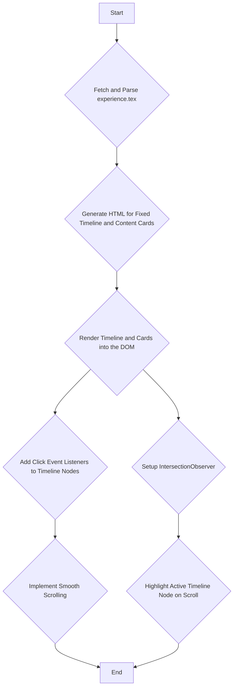

# Technical Plan: Parallax Timeline

This document outlines the technical plan for transforming the existing timeline section into a fullscreen interactive element with a parallax scrolling effect.

## 1. HTML Structure

The existing HTML structure in `demo/homepage-og/index.html` provides a good foundation. We will modify and enhance it to support the new parallax timeline.

The core of the new structure will be within the `<section id="timeline-interactive">`. We will repurpose it to be the main container for the parallax effect.

```html
<!-- This is a conceptual structure, not a direct copy-paste -->
<section id="parallax-container">
    <div id="timeline-fixed">
        <!-- The vertical timeline will be generated here by JavaScript -->
    </div>
    <div id="timeline-content">
        <!-- The scrolling content cards will be generated here by JavaScript -->
    </div>
</section>
```

### Key Changes in `index.html`:

1.  **Main Container**: We will use a main container, let's call it `#parallax-container`, to hold both the fixed timeline and the scrolling content. This will replace the current `#timeline-interactive` or be a child of it.
2.  **Fixed Timeline**: A `div` with `id="timeline-fixed"` will be created. This element will have `position: sticky` and will contain the vertical timeline with clickable nodes. JavaScript will populate this `div` with the timeline points.
3.  **Scrolling Content**: A `div` with `id="timeline-content"` will contain the detailed experience cards. As the user scrolls, these cards will move, while the fixed timeline stays in place. JavaScript will populate this `div` with content parsed from `experience.tex`. Each card will have a unique ID that corresponds to a timeline node, for example `experience-0`, `experience-1`, etc.

## 2. CSS Styling

The CSS will be crucial for creating the parallax and sticky effects. We will need to add new styles, likely in a new CSS file or within the existing `css/timeline.css`.

### Key CSS Properties:

1.  **`#parallax-container`**:
    *   `position: relative;`
    *   `display: flex;`
    *   `height: 100vh;` /* Or a height that suits the content */
    *   `overflow: hidden;` /* To contain the parallax effect */

2.  **`#timeline-fixed`**:
    *   `position: sticky;`
    *   `top: 0;`
    *   `width: 20%;` /* Example width */
    *   `height: 100vh;`
    *   `z-index: 10;`

3.  **`#timeline-content`**:
    *   `width: 80%;` /* Example width */
    *   `overflow-y: scroll;`
    *   This will be the main scrolling area.

4.  **Content Cards (`.experience-card`)**:
    *   `padding: 2rem;`
    *   `margin-bottom: 50vh;` /* To create space for the parallax effect */
    *   `min-height: 100vh;` /* To ensure each card takes up the full screen height */

## 3. JavaScript Logic

The JavaScript implementation will be handled in `js/timeline.js`, building upon the existing `TimelineController` class.

### Step-by-Step Implementation:

1.  **Fetch and Parse Data**:
    *   The existing `loadData` and `parseLatexExperience` methods are a great start. We will continue to use them to fetch and parse the data from `demo/homepage-og/resume-source/src/experience.tex`.

2.  **Dynamically Generate HTML**:
    *   Create a new method, `renderParallaxTimeline`, which will be responsible for generating the HTML for the fixed timeline and the content cards.
    *   **Timeline Nodes**: Inside `#timeline-fixed`, for each experience entry, create a clickable node (e.g., a `div` or `a` tag). Each node will have a `data-target` attribute pointing to the ID of the corresponding content card (e.g., `data-target="#experience-0"`).
    *   **Content Cards**: Inside `#timeline-content`, for each experience entry, create a content card `div` with a unique ID (e.g., `id="experience-0"`). This card will contain the details of the experience (role, company, date, description).

3.  **Implement Click-to-Scroll**:
    *   Add a click event listener to the timeline nodes in `#timeline-fixed`.
    *   When a node is clicked, get the `data-target` attribute.
    *   Use `document.querySelector(target).scrollIntoView({ behavior: 'smooth' })` to smoothly scroll the `#timeline-content` area to the corresponding content card.

4.  **Highlight Active Timeline Node (Optional but Recommended)**:
    *   Use the `IntersectionObserver` API to detect which content card is currently visible in the viewport as the user scrolls the `#timeline-content` area.
    *   When a new card enters the viewport, add an `active` class to the corresponding timeline node in `#timeline-fixed`.
    *   Remove the `active` class from other nodes. This will provide a visual cue to the user about their position on the timeline.

### Mermaid Diagram of the Flow:



This plan provides a comprehensive roadmap for implementing the interactive parallax timeline.